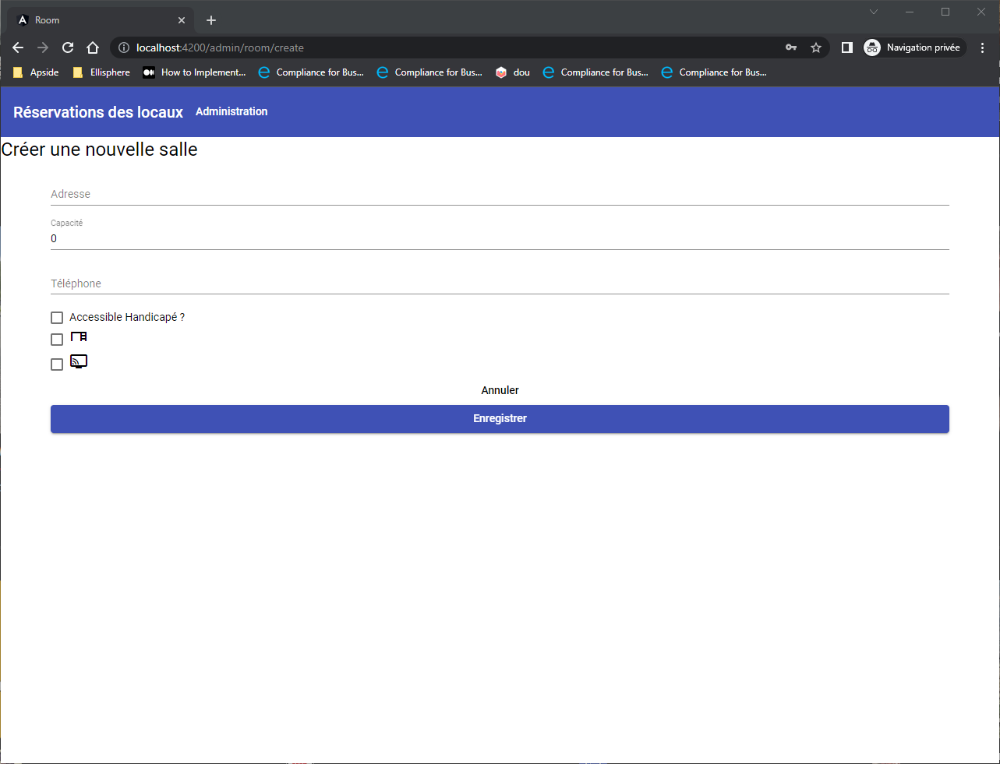
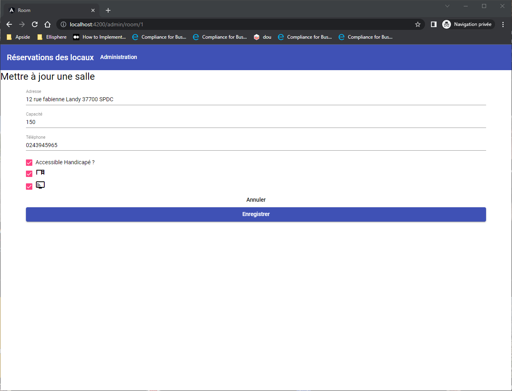

* Chapitre 0 :

- Création du projet à l'aide d'angular cli
- Migrer les tests unitaires pour la librairie jest
- Ajouter la librairie material
- Mise à jour du projet généré pour utiliser les standalones components (Optional)
- Procédé à l'affichage d'une navbar material et d'un titre
- Vérifier que les tests sont ok

* Chapitre 1 :

- Création du CRUD "local" pour la gestion des salles pour une future interface d'administration:
- La suppression doit demander une validation de l'action, puis recharger la liste en cas de suppression
- Suite à l'action de mise à jour ou de création, on retourne sur la liste des salles.
- La gestion des salles est faite de façon à pouvoir brancher une API par la suite.

Object room ->
```json
{
    id -> int
    capacity -> int
    accessibility -> boolean
    equipments: [
        TABLE,
        VISIO
    ],
    address: string,
    telephone: string
}
```

Voici un exemple des écrans attendus :

La liste des salles :


Création d'une salle :


Mise à jour d'une salle :
